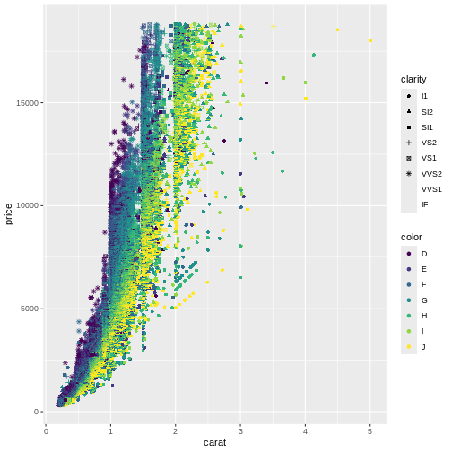
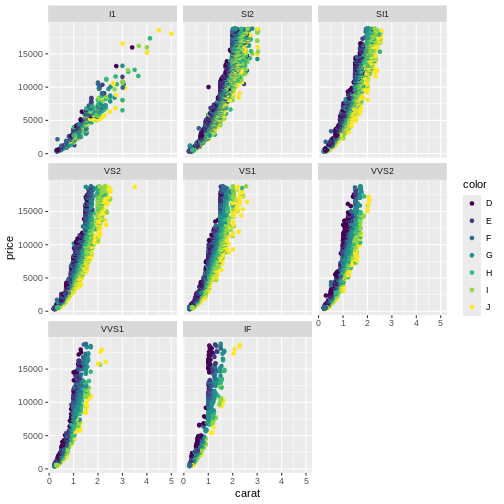
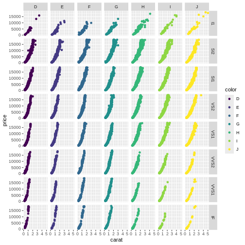

:::: questions
- What is facetting?
::::
  
:::: objectives
- Learn to use small multiples in your plots

::::
  


## Small multiples

If we only make one plot we quickly runs into the problem of trying to plot 
too much information in the plot. Here we plot the price against carat,
colour by the `color` of the diamonds. And represent their clarity by the
shape of the points:


``` r
ggplot(data = diamonds, mapping = aes(x = carat, y = price, colour = color, shape = clarity)) +
  geom_point()
```

``` warning
Warning: Using shapes for an ordinal variable is not advised
```

``` warning
Warning: The shape palette can deal with a maximum of 6 discrete values because more
than 6 becomes difficult to discriminate
ℹ you have requested 8 values. Consider specifying shapes manually if you need
  that many of them.
```

``` warning
Warning: Removed 5445 rows containing missing values or values outside the scale range
(`geom_point()`).
```



This is probably not the best way to discover patterns in the data. It is 
actually so bad that ggplot warns us that we are using too many different shapes!

One way of handling that, is to plot "small multiples" of the data. 

Instead of plotting information on the clarity of the diamonds in one plot,
along with all the other information, we make one plot for each value of 
clarity. This is called facetting:


``` r
ggplot(data = diamonds, mapping = aes(x = carat, y = price, colour = color)) +
  geom_point() +
  facet_wrap(~clarity)
```


Here we can see that the price rises more rapidly with size, for the better 
clarities, something that would have been impossible to see in the previous plot.

:::: callout
## Hidden connections

facet_wrap is specified using the `~clarity` notation. 
 
This is similar to the way R specifies formulas:
 
y ~ x would in eg. regressions in R specify that y is a function of x. 
 
Here we can think of it as "making plots that are a function of clarity"

::::

The fundamental idea behind faceting, is the concept "small multiples", popularised
by Edward Tufte. He describes it as (resembling) "the frames of a movie: a series 
of graphics, showing the same combination of variables, indexed by changes in 
another variable.” The method is also known as "trellis", "lattice", "grid" or
"panel" charts. They allows us to break down a very "busy" chart, containing too
much information, making it possible for the reader of the charts to walk
through them one category at a time, and make comparisons.


:::: challenge
## Exercise

Plot price as a function of depth (price on the y-axis, depth on the x-axis),
and facet by cut. If you want a colourful plot, colour the points
by `color`.

:::: solution
## Solution


``` r
ggplot(data = diamonds, mapping = aes(x = depth, y = price, colour = color)) +
  geom_point() +
  facet_wrap(~cut)
```


Note that for the better cuts, diamonds are cut to pretty
specific proportions. Worse (Fair) diamonds have more 
varied proportions.

::::
::::

## More than one multiple

We can expand on the "small multiple" concept, by plotting the
facets in a grid, defined by two categorical values.

In this plot we plot price as a function of carate, and 
make individual plots for each combination of `clarity` and `color`:


``` r
diamonds |>
  ggplot(aes(x = carat, y = price, colour = color)) +
    geom_point() +
    facet_grid(clarity ~ color)
```



Be careful using facets, especially *facet_grid* when you work
with small datasets. You might end up with too little data in 
each facet.


:::: keypoints
- Facetting can make busy plots more understandable
- Grid facetting in two dimensions allows us to plot even more variables
::::
