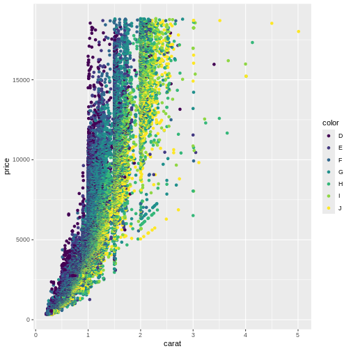
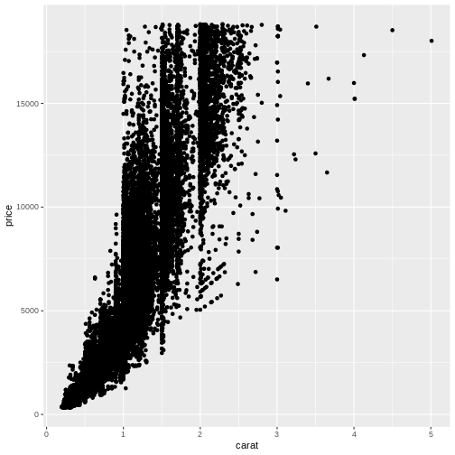

:::: questions
- "Can we show data using something other than position?"
- "What is correct, colour or color?"
- "How do I find out what a `geom_` can do?"
::::

:::: objectives
- "Learn to plot more than just positions"

::::


We saw how to map data to a position in a scatterplot. But we are able to map 
the data to other elements of a plot, eg the colour of the points.


``` r
ggplot(data = diamonds, mapping = aes(x = carat, y = price, colour = color)) +
  geom_point() 
```



The argument to which we are mapping the values in the column *color* is also
called *colour*, making the code look a bit weird.

Are these colours suitable? Probably not. The authors of this course
material are not able to distinguish all of the colours. We will return to how 
to change colours in plots later in this course.


:::: callout
## Spelling
 
Colour, and some other words can be spelled in more than one way.
For arguments, ggplot understands both the correct english spelling
*colour* and the american spelling *color*.
 
Note that this only applies to the arguments in the functions. If the
column in the dataset is called *color*, ggplot will not find it if
you write *colour* instead.

In an attempt to reduce confusion, we use *colour* for the arguments and
*color* when we refer to the variable `color`.

::::

Not surprisingly, the "best" colour, D have higher prices than the "worst"
colour, "J".

A common mistake is to place the colour argument a wrong place:

``` r
ggplot(data = diamonds, mapping = aes(x = carat, y = price), colour = color) +
  geom_point()
```

``` warning
Warning in fortify(data, ...): Arguments in `...` must be used.
✖ Problematic argument:
• colour = color
ℹ Did you misspell an argument name?
```


What happened to the colour? The colour argument is outside the aes() function.
That means that we are not mapping data to the colour!


## What else can we map data to?

More or less every phenomenon in a scatter plot can have data mapped to it, eg.
the size of the points:


``` r
ggplot(data = diamonds, mapping = aes(x = carat, y = price, colour = color, size = table)) +
  geom_point()
```


Not at good plot... We need to think about the combination of stuff we want to
plot. Often two plots are better than trying to cram everything into a single plot.

What can be mapped to the plot depends on the geom we are using. 

Calling the help function, eg `?geom_point`, on a geom will provide insight on that
question. Doing it on the `geom_point()` function, reveals that x and y are mandatory
because they are in bold.

The list of stuff we can map data to in geom_point:

* **x**
* **y**
* alpha
* colour
* fill
* group
* shape
* size
* stroke

Different geom_ functions have different mandatory/required aesthetics.

## Not really mapping. Sorta.

Rather than mapping values from data to an aesthetic, we can provide
values directly. One very useful aesthetic to play with, at least when
we have as many datapoints as we have here, is `alpha`:


``` r
ggplot(data = diamonds, mapping = aes(x = carat, y = price, colour = color)) +
  geom_point(alpha = 0.1)
```


`alpha` controls the transparency of the points plotted, and is a handy way of
handling overplotting, the phenomenon that multiple data points might be 
identical. In this example we set `alpha` to be 0.1, we could have mapped
a variable to it instead.


:::: callout
## geoms

geom_point() is the function we use to make scatter plots; because points is
a geometric object. 
Other geometric objects can be plotted:

* geom_histogram() will plot histograms
* geom_line() will plot lines
 
All geometries in ggplot2 are named using the pattern geom_

::::

## Using shapes in the plot

Shapes can be useful if we want to make plots that are robust in regards to
colour reproduction on screens, in printers or for people with reduced
colour vision.
In principle we can plot any kind of shape. But without having to program them
ourself, these are available directly in ggplot. They are numbered, because it is easier to write "14" than "square box with upwardspointing triangle inside".


:::: keypoints
- "Data can be plottet as something other than position"
- "Types of plots are determined by `geom_`functions"
::::
