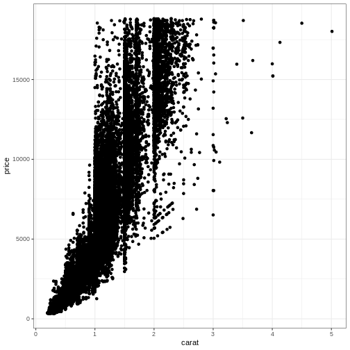
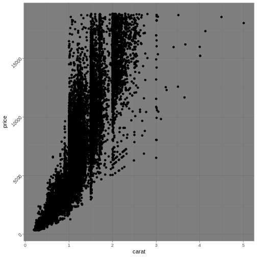
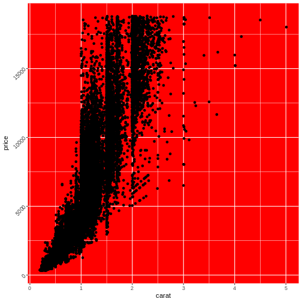

:::: questions
- "How can I make the plot look good?"
- "How do I get rid of that grey background?"
- "How do I get rid of the gridlines?"
::::

::::objectives
- "Learn to use different themes"
- "Learn to adjust the appearance of specific parts of the plot"
::::


### The THEME_FUNCTIONs

Every part of the plot can be changed. The grey background might be annoying
The gridlines might be confusing.

These non-data components of the plots can be controlled using the family of `theme`
functions:


``` r
ggplot(diamonds, aes(carat, price)) +
  geom_point() +
  theme_bw()
```


More exists:

``` error
Error: Can't find method for generic `|(e1, e2)`:
- e1: <ggplot2::ggplot>
- e2: <ggplot2::ggplot>
```

:::: callout
## Notice the pattern?

A general pattern of function names in ggplot2 can be seen.

Themes are named "theme_" and then the name of the theme. We saw the
same pattern with the scale functions: "scale_" and then the axis, followed
by what we did to the axis, eg: "scale_y_log10"

::::

### Even more theming

*Every* element in the plot can be controlled. The `theme()`  function is the
way to do that:


``` r
diamonds |> 
  ggplot(aes(carat, price)) +
  geom_point() +
  theme_dark() +
  theme(axis.text.y = element_text(angle= 45))
```



Angling the labels in a plot can be good for readability. However the actual
way to do it can be a bit more involved as you see above. Read the help for
theme to get at complete list of things that can be changed. There are 97 
things in total.

Also note, that we can add theming on top of previous theming. Here we begin
with a built-in theme that we like, and change the parts we want to change. 

Finally note, that the order is important:


``` r
diamonds |>
  ggplot(aes(carat, price)) +
  geom_point() +
  theme_dark() +
  theme(axis.text.y = element_text(angle= 45))
```
and 

``` r
diamonds |>
  ggplot(aes(carat, price)) +
  geom_point() +
  theme(axis.text.y = element_text(angle= 45)) +
  theme_dark() 
```

Will not give the same result. `theme_dark` has a setting for the way the text
on the y-axis is shown, and will overwrite the changes done before calling it.

Most of the `elements` of the plot need to be defined in a special way. If we 
want the "theme" a text element, we set the `axis.text` to be an `element_text()` 
function with specific arguments to specify *what* we want to do. For the background
of the plot we are changing a rectangular object `element_rect`, and can set the background
colour like this: 


``` r
diamonds |>
  ggplot(aes(carat, price)) +
  geom_point() +
  theme(axis.text.y = element_text(angle= 45),
        panel.background = element_rect(fill = "red"))
```


Note that we are not setting the `plot.background`, as that would change the 
background of the entire plot, rather than the background of the actual 
area on which we are plotting.

::::keypoints
- "EVERYTHING in the plot can be customized"
::::
